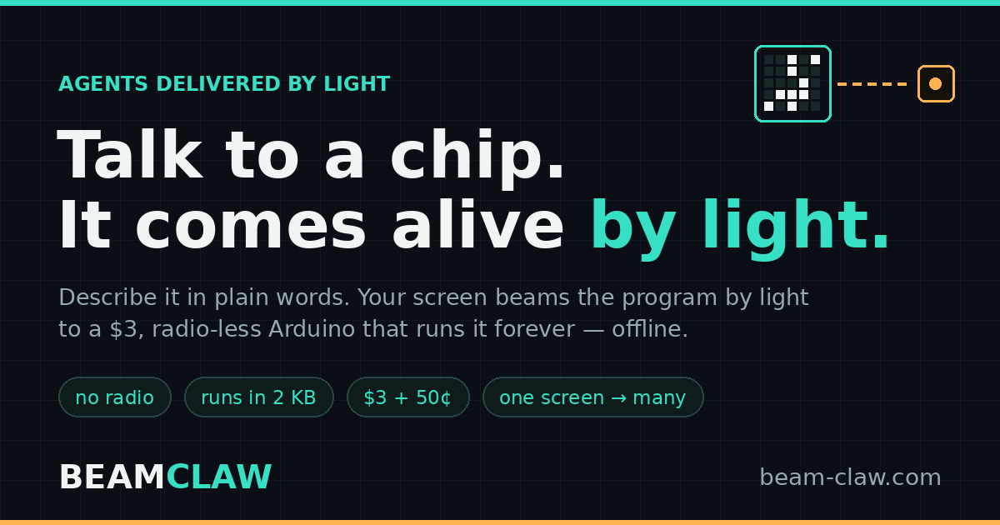
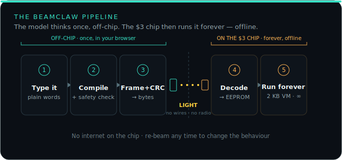

<div align="center">



# BeamClaw — agents delivered by light

**Talk to a chip; it comes alive by light.**

Describe a behaviour in plain words. An LLM compiles a tiny, safety-checked program and your
**screen beams it as flickering light** to a **\$3, radio-less Arduino** — which then runs it
**forever, offline**. No IDE. No USB cable. No WiFi. No app.

[](LICENSE)
[](https://www.arduino.cc/)


[](https://github.com/technicalaj/beamclaw/stargazers)

### [🌐 Live site](https://beam-claw.com) · [▶ Console](https://beam-claw.com/app) · [⚡ Flash a board](https://beam-claw.com/flash) · [📖 Docs](https://beam-claw.com/docs)

</div>

---

<div align="center">

### 🎥 See it actually work — real hardware, no cuts

[](https://beam-claw.com/#how)

**[▶ Watch the full 90-second HD demo →](https://beam-claw.com/#how)**

<sub>Type a behaviour → the screen beams it as light → a $3 Arduino runs it. Filmed in one take.</sub>

</div>

---

> **Not "an LLM in 2 KB" (that's impossible) — it's LLM-compiled _agency_ in 2 KB.**
> The model thinks once, off-chip. The chip acts forever, on its own.

## ⚡ Quick start

1. **Flash once** — open [`flash.html`](flash.html) in desktop Chrome/Edge, plug in an Arduino Uno, click **Flash**. Installs the firmware over Web Serial — no Arduino IDE. You only do this once.
2. **Wire a light sensor** — a 3-pin LDR module: `S→A0`, `+→5V`, `−→GND`. Point it at your screen.
3. **Talk to it** — open [`app.html`](app.html), type e.g. *"blink when it gets dark."* Built-ins are free; add your own Anthropic key for free-form requests. Hold the sensor to the panel and press **Beam**.

The chip stores the program and runs it offline forever. Re-beam any time to change it.

## 🔦 How it works

`English → compile + safety-check (off-chip) → frame · whiten · CRC → LIGHT (screen → LDR) → chip stores to EEPROM → a 2 KB virtual machine runs it forever.`

<div align="center">

</div>

A deterministic assembler turns the proposal into bytecode and a validator proves it's safe —
legal opcodes, in-range jumps, never driving the serial or sensor pins — **before a single bit
leaves the screen.** Full write-up, wiring and the instruction set are in [`docs.html`](docs.html).

## 📦 What's in here

```
beamclaw/
├─ index.html · app.html · flash.html · docs.html   the website (static, no build step)
├─ assets/       style.css, app.js (console engine), flash.js (Web Serial flasher),
│                fx.js, firmware.js (embedded firmware), diagrams, icons, og image
├─ firmware/     beamclaw_agent.ino (source) + beamclaw_agent.hex (compiled)
└─ _smoke/       smoke.sh — pre-deploy checks
```

## 🚀 Deploy

Static site — host it anywhere. It's live at **[beam-claw.com](https://beam-claw.com)** on shared
Apache (the included `.htaccess` gives clean, extensionless URLs). For **GitHub Pages**: Settings →
Pages → Deploy from branch → `main` / root, add a custom domain, and HTTPS is automatic — *don't buy
an SSL certificate.* Netlify and Cloudflare Pages work the same way (drag-drop, free HTTPS). Run
`bash _smoke/smoke.sh` before shipping.

> One-click flashing needs **desktop Chrome or Edge** over `https://` or `localhost` (Web Serial
> isn't available in Safari/Firefox or on phones). Everything else works anywhere.

## ✅ Status & honesty

Firmware is hardware-confirmed: **498 B RAM / 23 % flash** on an ATmega328 (Uno). The optical link
decodes through **70 % packet loss** in simulation. Today it's slow (~10–15 bps), line-of-sight,
one-way and unauthenticated — fine for hobby and education; add an HMAC signature for anything
sensitive.

## 📜 License

**[MIT](LICENSE)** — free for anyone to use, modify and even sell; it just keeps the copyright
notice attached, so you always get credit. A ⭐ and a link back are appreciated. **"BeamClaw" and
the logo are trademarks of Akash Jayswal** (see [`LICENSE.md`](LICENSE.md)) — fork under a different
name.

## 🙌 Credits

Built on the shoulders of the Claw ecosystem (OpenClaw, ESP-Claw, MimiClaw), plus ggwave, Microvium
and the Timex Datalink — pioneers of tiny agents and data-over-light/sound.
